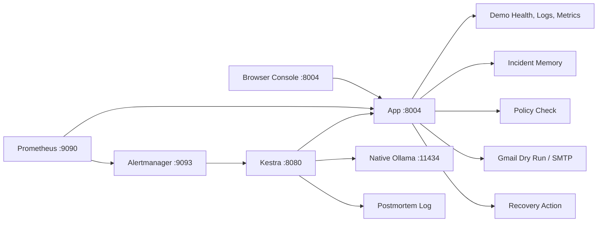

# Architecture

The simplified architecture has one app process and four infrastructure containers.

## Runtime Split

Docker runs:

- Kestra
- PostgreSQL
- Prometheus
- Alertmanager

Node.js runs:

- app on `localhost:8004`

There are no separate app containers and no separate local helper services.

## App Modules

- `server.js` boots Express.
- `routes.js` owns HTTP routes.
- `config.js` reads environment settings.
- `demoService.js` owns the breakable demo service state.
- `incidentStore.js` owns local JSON incident memory.
- `policy.js` checks safe recovery actions.
- `notification.js` handles Gmail dry-run or SMTP delivery.
- `kestraClient.js` starts Kestra executions from the browser console.
- `catalog.js` stores service ownership and safe actions.

## Incident Flow

1. The app exposes demo service metrics at `/metrics`.
2. Prometheus scrapes `host.docker.internal:8004`.
3. Alertmanager sends firing alerts to the Kestra webhook.
4. Kestra reads health, metrics, logs, service context, and prior incidents from the app.
5. Kestra asks native Ollama for triage.
6. Kestra asks the app to evaluate the requested action.
7. Kestra sends or dry-runs a Gmail notification through the app.
8. If allowed, Kestra calls the app recovery action.
9. Kestra verifies `/health`, records the incident, and writes a postmortem log.

## Why This Shape

The older version used separate local services for demo, notification, memory, recovery, UI, and log generation. That was useful for learning distributed orchestration, but it was too noisy for this project.

The simplified version keeps the real orchestration lesson in Kestra while making the local app layer easy to understand.
